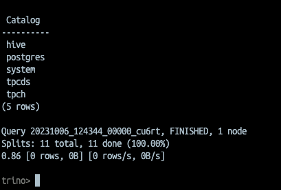
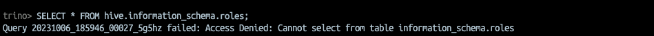

# brenntag-dataops-eng-assignment
made by Fabio Yuji Ivamoto

# ARCHITECTURE


# Requirements
1. Kubernetes (or any K8s provider)
2. Docker
3. Helm
4. python

# Application Local test
1. Start bigdata environment via Docker compose
```
cd local_setup/hive-metastore-main

docker-compose up
```

2. Within trino container we can see HIVE is intergrated. 

```
trino;
show catalogs;
```


3. Start the REST application from the root folder
```

docker build \
    -t brenntag_api_csv \
    --no-cache \
    ./app

```

4. Run the container
```
docker run --name my-flask-app -p 5001:5001 --network host -d brenntag_api_csv

```
obs: Here I could not make the app to communicate with the services.

5. Or run the python code locally

```
python ./app/api_csv.py
```
Running straight via python, all the services are reachable :)

4. Check the services running via browser


5. Upload a csv file


Obs: Check final remarks! You will get an error when applying the query + csv file uploaded.

6. Check Bucket in Minio


# Kubernetes Configuration
In this case, I used minikube.
1. enable ingress to pull images from internet `minikube addons enable ingress`


# Initial setup for Kubernetes
1. The script below install all infrastructure from public repositories
```
sh deployments/scripts/up.sh

```
2. I have created a helm chart for the REST app python. We install in the same way using helm.

```
sh deployments/app_deployment.sh
```

3. You can check all services up and running in Kubernetes


# Trino configuration

To make trino available via browser:
1. Port forward:
```
export POD_NAME=$(kubectl get pods --namespace trino -l "app=trino,release=brenntag-trino-cluster,component=coordinator" -o jsonpath="{.items[0].metadata.name}")
kubectl port-forward $POD_NAME 8080:8080 -n trino
```

# Clean Up environment
1. `sh down.sh`
2. `helm uninstall brenntag-api -n trino`
3. `minikube delete --all`

# Final remarks
**1. Even with all service up and running in my local, I couldn't make any user to run CREATE SCHEMA and CREATE TABLE in TRINO**


So the flask python app is not able to create the desired table from the csv uploaded. But here, the intention was to upload a csv and include the QUERY sintax for TRINO to create an external table with the location pointing to the s3/minio path

2. I am definitely not good on configuring network/ports/ingress within containers in Kubernetes. Even all containers running in the same network, forwarding the ports. creating ingress charts, I was not able to make the flask app available via local browser when it's running in minikube/k8s. I'm open for suggestions and help here :) 

# REFS

1. https://trino.io/docs/current/installation/kubernetes.html#running-a-local-kubernetes-cluster-with-kind
2. https://minikube.sigs.k8s.io/docs/start/
3. https://github.com/komodorio/helm-dashboard
4. https://min.io/download#/kubernetes
5. https://github.com/trinodb/trino-python-client/blob/master/README.md
6. https://github.com/naushadh/hive-metastore/blob/main/README.md