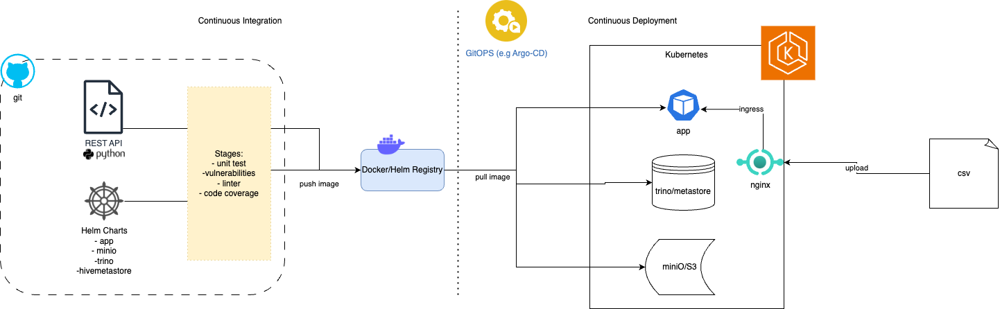
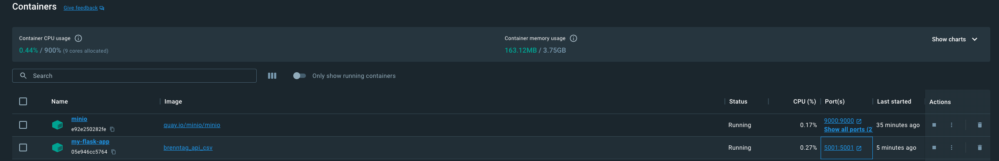
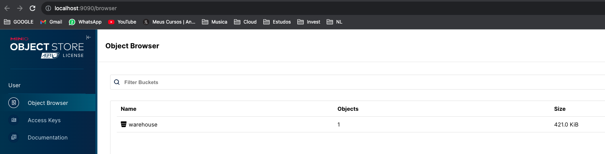
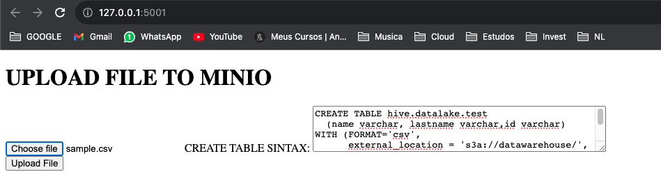
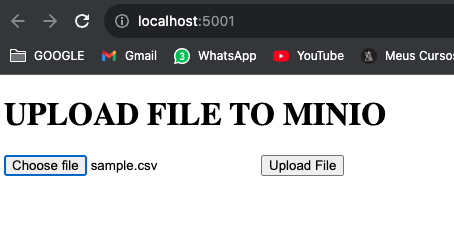
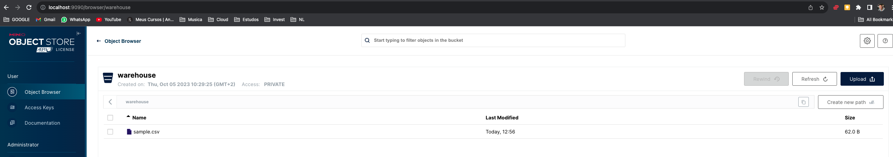
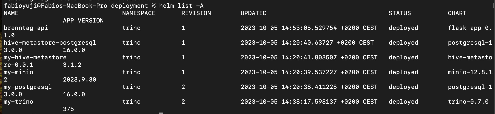

# brenntag-dataops-eng-assignment
made by Fabio Yuji Ivamoto

# ARCHITECTURE


# Requirements
1. Kubernetes (or any K8s provider)
2. Docker
3. Helm

# Application Local test
1. Create a bridge network
`docker network create brenntag-network`

2. Start minio environment via Docker
```
mkdir -p ~/minio/data

docker run \
   -p 9000:9000 \
   -p 9090:9090 \
   --name minio \
   -v ~/minio/data:/data \
   -e "MINIO_ROOT_USER=minio_access_key" \
   -e "MINIO_ROOT_PASSWORD=minio_secret_key" \
   --network brenntag-network \
   quay.io/minio/minio server /data --console-address ":9090"
```

3. Start the application from the root folder
```

docker build \
    -t brenntag_api_csv \
    --no-cache \
    ./app

```

4. Run the container

`docker run --name my-flask-app -p 5001:5001 --network brenntag-network -d brenntag_api_csv`

4. Check the services running via browser





5. Upload a csv file




6. Check Bucket in Minio




# Kubernetes Configuration
In this case, I used minikube.
1. enable ingress to pull images from internet `minikube addons enable ingress`


# Initial setup for Kubernetes
1. run `sh deployments/scripts/up.sh`
2. run `sh deployments/app_deployment.sh`



2. `kubectl expose deployment my-minio-cc97b56cc-52vkw --name=my-minio`

The up.sh install all services using Packages from public repositories
```
kubectl create namespace trino --dry-run=client -o yaml | kubectl apply -f -
helm repo add bitnami https://charts.bitnami.com/bitnami
helm repo add trino https://trinodb.github.io/charts/
helm upgrade --install my-postgresql bitnami/postgresql -n trino -f postgresql/values.yaml
helm upgrade --install my-minio bitnami/minio -n trino -f minio/values.yaml
helm upgrade --install hive-metastore-postgresql bitnami/postgresql -n trino -f hive-metastore-postgresql/values.yaml
helm upgrade --install my-hive-metastore -n trino -f hive-metastore/values.yaml ../charts/hive-metastore
helm upgrade --install my-trino trino/trino --version 0.7.0 --namespace trino -f trino/values.yaml
```


# Trino configuration

To use trino via browser:
1. Port forward:
```
export POD_NAME=$(kubectl get pods --namespace trino -l "app=trino,release=brenntag-trino-cluster,component=coordinator" -o jsonpath="{.items[0].metadata.name}")
kubectl port-forward $POD_NAME 8080:8080 -n trino
```

# Minio Configuration
to use minio via brorser
1. asdasd
```
export POD_NAME=$(kubectl get pods --namespace trino -l "app=trino,release=brenntag-trino-cluster,component=coordinator" -o jsonpath="{.items[0].metadata.name}")
kubectl port-forward $POD_NAME 8080:8080 -n trino
```
3. 
``` 
kubectl run --namespace trino my-minio-client \ 
     --rm --tty -i --restart='Never' \
     --env MINIO_SERVER_ROOT_USER=$ROOT_USER \
     --env MINIO_SERVER_ROOT_PASSWORD=$ROOT_PASSWORD \
     --env MINIO_SERVER_HOST=my-minio \
     --image docker.io/bitnami/minio-client:2023.9.29-debian-11-r0 -- admin info minio
``` 


# Clean Up environment
1. `sh down.sh`
2. `helm uninstall brenntag-api -n trino`
3. `minikube delete --all`


# REFS

1. https://trino.io/docs/current/installation/kubernetes.html#running-a-local-kubernetes-cluster-with-kind
2. https://minikube.sigs.k8s.io/docs/start/
3. https://github.com/komodorio/helm-dashboard
4. https://min.io/download#/kubernetes